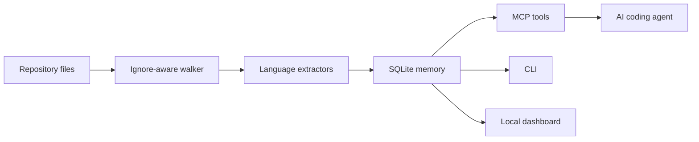

# RepoLens MCP

Local-first repository intelligence for AI coding agents. Index a repo into SQLite, expose architecture-aware MCP tools, and inspect code relationships in a browser dashboard.

RepoLens MCP is an original TypeScript implementation built around fast local verification, readable internals, and reviewable engineering evidence. It focuses on the workflows engineers actually need during AI-assisted development: finding code, tracing symbols, checking impact, and preserving architecture decisions.

## Why It Stands Out

- **MCP-native**: exposes 21 tools for indexing, BM25 code search, symbol search, semantic search, source snippets, graph schema, structural graph search, graph community detection, read-only Cypher-like graph queries, route-call links, Docker/Kubernetes infrastructure nodes, dependency-cycle detection, architecture reports, architecture summaries, tracing, git-change impact, dead-code candidates, ADRs, graph snapshots, and graph package exchange.
- **Codex-ready setup**: `doctor` inspects the local Codex MCP configuration, and `install-codex` can add a managed MCP block with dry-run and force safeguards.
- **Local-first SQLite memory**: all indexed data stays in `.repolens/memory.db`.
- **Incremental refreshes**: skip unchanged files, prune removed files, and preserve the existing graph when a repo has not changed.
- **Watch mode**: keep an indexed graph fresh during active coding with polling-based incremental refreshes.
- **Portable graph and report artifacts**: export self-contained HTML graph snapshots, architecture reports, and compressed `.rlgz` graph packages from the CLI.
- **Operational dashboard**: browse graph previews, structural filters, schema counts, dead-code candidates, review signals, and report links without a frontend build.
- **Graph communities**: detects functional modules from weighted relationships, not just folder names.
- **Code-aware search ranking**: uses SQLite FTS5 BM25 ranking with indexed camelCase and snake_case term expansion, so `create order` can find `createOrder` without scanning files.
- **Local semantic graph**: adds dependency-free `SIMILAR_TO` and `SEMANTICALLY_RELATED` edges plus concept search over names, paths, signatures, and symbol bodies.
- **Route-call edges**: connects literal `fetch`/Axios/Node HTTP calls to indexed route nodes with `HTTP_CALLS` edges.
- **Infrastructure graph nodes**: indexes Dockerfile stages/images, Kubernetes resources, container images, and Kustomize overlays with `DECLARES`, `CONFIGURES`, and `IMPORTS` edges.
- **Architecture recommendations**: turns hotspots, import-resolved dependency cycles, dead-code candidates, and review signals into concrete next steps.
- **Wide practical coverage**: TypeScript, JavaScript, Swift, Python, Go, Java, Rust, SQL, YAML, Markdown, JSON, and shell-oriented project files.
- **Validation evidence**: tests, CI, CodeQL, docs, local dashboard, and a big-repo validation workflow.
- **Architecture decisions built in**: persist ADR-style decisions next to the code graph.
- **No frontend build required**: the dashboard is served by the CLI.

## Quick Start

```bash
npm install
npm run build
node --experimental-sqlite dist/src/cli.js index .
node --experimental-sqlite dist/src/cli.js architecture
node --experimental-sqlite dist/src/cli.js serve
```

Then open `http://127.0.0.1:9749`.

The dashboard includes code search, graph search, graph schema tables, hotspot and boundary summaries, dead-code candidates, and one-click Markdown/HTML architecture reports.

## CLI

```bash
repolens-mcp index [repo] [--db path] [--max-file-bytes n] [--incremental]
repolens-mcp architecture [--db path]
repolens-mcp search <query> [--db path]
repolens-mcp symbols <query> [--kind function]
repolens-mcp snippet <symbol-or-path:line> [--context n]
repolens-mcp trace <symbol> [--direction inbound|outbound]
repolens-mcp impact <path-or-symbol...>
repolens-mcp schema [--db path]
repolens-mcp communities [--db path] [--limit n] [--min-size n]
repolens-mcp watch [repo] [--db path] [--interval-ms n]
repolens-mcp search-graph [query] [--kind function] [--relationship CALLS] [--min-degree n]
repolens-mcp semantic "live session repository" [--limit n]
repolens-mcp query-graph "MATCH (a)-[:CALLS]->(b) RETURN a.name,b.name LIMIT 5"
repolens-mcp dead-code [--db path]
repolens-mcp cycles [--db path] [--limit n]
repolens-mcp changes [repo] [--db path]
repolens-mcp report [--db path] [--format markdown|html] [--graph-limit n] [--out report.html]
repolens-mcp export-graph --out graph.html [--db path]
repolens-mcp pack-graph --out graph.rlgz [--db path] [--label name]
repolens-mcp unpack-graph graph.rlgz [--db path] [--overwrite]
repolens-mcp doctor [--config ~/.codex/config.toml] [--name repolens]
repolens-mcp install-codex [--db .repolens/memory.db] [--dry-run] [--force]
repolens-mcp decision --title "Use SQLite" --body "Keep memory local."
repolens-mcp serve [--db path] [--port 9749]
repolens-mcp mcp
```

## MCP Tools

| Tool | Purpose |
| --- | --- |
| `index_repository` | Build or refresh the local SQLite memory. |
| `export_graph_package` | Create a compressed, checksummed `.rlgz` package from an indexed graph database. |
| `import_graph_package` | Import a compressed `.rlgz` package into a local graph database. |
| `search_code` | Search indexed source lines with BM25 ranking and code-aware token expansion. |
| `search_symbols` | Search functions, classes, routes, resources, headings, and package nodes. |
| `get_code_snippet` | Return source lines around a symbol, qualified name, file path, or `path:line` target. |
| `get_architecture` | Return language mix, hotspots, entrypoints, packages, and risk markers. |
| `trace_symbol` | Trace inbound or outbound graph edges around a symbol. |
| `impact_analysis` | Find adjacent symbols for changed files or symbols. |
| `get_graph_schema` | Return node labels, edge types, language coverage, and totals. |
| `find_communities` | Detect weighted graph communities with representative symbols, cohesion, and boundary counts. |
| `search_graph` | Search structurally by query, kind, regex, relationship, file scope, or degree. |
| `semantic_search` | Search symbols by local semantic token overlap across names, paths, signatures, and bodies. |
| `query_graph` | Run a read-only Cypher-like query over symbols and one-hop edges. |
| `find_dead_code` | Find non-exported functions and methods with no inbound call edges. |
| `find_dependency_cycles` | Find import-resolved dependency cycles between architecture clusters. |
| `detect_changes` | Map uncommitted git changes to indexed graph impact. |
| `architecture_report` | Generate a markdown or HTML architecture report from the indexed graph. |
| `remember_decision` | Persist an ADR-style architecture decision. |
| `list_decisions` | Retrieve saved decisions. |
| `graph_snapshot` | Export compact graph data for dashboards or reviews. |

## Supported Extraction

The extractor is intentionally compact and extensible:

- TypeScript and JavaScript: classes, interfaces, types, functions, const functions, imports, Express-style routes.
- HTTP call linking: literal `fetch`, Axios, and Node `http` calls are linked to matching route nodes as `HTTP_CALLS`.
- Swift: classes, structs, enums, protocols, actors, functions, and imports.
- Python: classes, functions, imports, route decorators.
- Go, Java, Rust: common functions, types, classes, traits, structs, imports.
- SQL: created tables, views, indexes, functions, procedures.
- YAML: multi-document Kubernetes resources from `kind` and `metadata.name`, container image links, and Kustomize `resources`, `bases`, and `components`.
- Dockerfile: build stages, base images, and `COPY --from` stage dependencies.
- Markdown: headings as knowledge nodes.
- JSON: `package.json` package and dependency nodes.

## Query Graph Subset

`query-graph` and `query_graph` are read-only. Supported patterns:

```cypher
MATCH (f:Function) WHERE f.name = 'main' RETURN f.name,f.filePath LIMIT 10
MATCH (a)-[r:CALLS]->(b) WHERE b.name CONTAINS 'order' RETURN a.name,b.name,r.type LIMIT 10
MATCH (a)<-[:CALLS]-(b) RETURN a.name,b.name LIMIT 10
```

Supported `WHERE` operators are `=`, `<>`, `CONTAINS`, `STARTS WITH`, and `ENDS WITH`, joined with `AND`.

## Validation

```bash
npm run verify
node --experimental-sqlite dist/src/cli.js index /path/to/big/repo --db /tmp/memory.db
node --experimental-sqlite dist/src/cli.js index /path/to/big/repo --db /tmp/memory.db --incremental
node --experimental-sqlite dist/src/cli.js architecture --db /tmp/memory.db
node --experimental-sqlite dist/src/cli.js schema --db /tmp/memory.db
node --experimental-sqlite dist/src/cli.js communities --db /tmp/memory.db --limit 12
node --experimental-sqlite dist/src/cli.js snippet createOrder --db /tmp/memory.db
node --experimental-sqlite dist/src/cli.js semantic "order checkout flow" --db /tmp/memory.db
node --experimental-sqlite dist/src/cli.js cycles --db /tmp/memory.db
node --experimental-sqlite dist/src/cli.js query-graph "MATCH (f:Function) RETURN f.name,f.filePath LIMIT 5" --db /tmp/memory.db
node --experimental-sqlite dist/src/cli.js report --db /tmp/memory.db --format html --out report.html
node --experimental-sqlite dist/src/cli.js export-graph --db /tmp/memory.db --out graph.html --limit 1000
node --experimental-sqlite dist/src/cli.js pack-graph --db /tmp/memory.db --out graph.rlgz --label validation
node --experimental-sqlite dist/src/cli.js unpack-graph graph.rlgz --db /tmp/imported-memory.db
node --experimental-sqlite dist/src/cli.js watch /path/to/big/repo --db /tmp/memory.db --interval-ms 2500
node --experimental-sqlite dist/src/cli.js serve --db /tmp/memory.db --port 9749
```

The repo includes `docs/research-notes.md` with source-research notes and the design decisions behind this implementation.
It also includes `docs/validation-report.md` with the local self-index and `/Users/sameer/Desktop/testing` big-repo validation results.

## MCP Client Config

Codex users can inspect or install the MCP entry directly:

```bash
repolens-mcp doctor
repolens-mcp install-codex --db .repolens/memory.db --dry-run
repolens-mcp install-codex --db .repolens/memory.db
```

`install-codex` refuses to replace an existing unmanaged `mcp_servers.repolens` entry unless `--force` is passed.

```json
{
  "mcpServers": {
    "repolens-mcp": {
      "command": "npx",
      "args": ["-y", "repolens-mcp", "mcp"],
      "env": {
        "REPOLENS_DB": ".repolens/memory.db"
      }
    }
  }
}
```

## Architecture



## Roadmap

- Tree-sitter adapters for deeper language parsing.
- Import resolver for monorepos and workspace packages.
- Semantic ranking and richer cross-repo queries.
