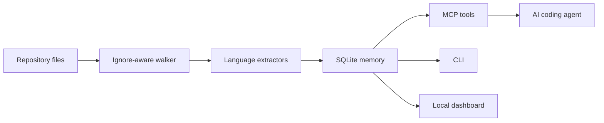

# RepoLens MCP

Local-first repository intelligence for AI coding agents. Index a repo into SQLite, expose architecture-aware MCP tools, and inspect code relationships in a browser dashboard.

RepoLens MCP is an original TypeScript implementation built around fast local verification, readable internals, and recruiter-friendly proof. It focuses on the workflows engineers actually need during AI-assisted development: finding code, tracing symbols, checking impact, and preserving architecture decisions.

## Why It Stands Out

- **MCP-native**: exposes tools for indexing, code search, symbol search, architecture summaries, tracing, impact analysis, ADRs, and graph snapshots.
- **Local-first SQLite memory**: all indexed data stays in `.repolens/memory.db`.
- **Recruiter-friendly proof**: tests, CI, CodeQL, docs, local dashboard, and a big-repo validation workflow.
- **Architecture decisions built in**: persist ADR-style decisions next to the code graph.
- **No frontend build required**: the dashboard is served by the CLI.

## Quick Start

```bash
npm install
npm run build
node --experimental-sqlite dist/src/cli.js index .
node --experimental-sqlite dist/src/cli.js architecture
node --experimental-sqlite dist/src/cli.js serve
```

Then open `http://127.0.0.1:9749`.

## CLI

```bash
repolens-mcp index [repo] [--db path] [--max-file-bytes n]
repolens-mcp architecture [--db path]
repolens-mcp search <query> [--db path]
repolens-mcp symbols <query> [--kind function]
repolens-mcp trace <symbol> [--direction inbound|outbound]
repolens-mcp impact <path-or-symbol...>
repolens-mcp decision --title "Use SQLite" --body "Keep memory local."
repolens-mcp serve [--port 9749]
repolens-mcp mcp
```

## MCP Tools

| Tool | Purpose |
| --- | --- |
| `index_repository` | Build or refresh the local SQLite memory. |
| `search_code` | Search indexed source lines. |
| `search_symbols` | Search functions, classes, routes, resources, headings, and package nodes. |
| `get_architecture` | Return language mix, hotspots, entrypoints, packages, and risk markers. |
| `trace_symbol` | Trace inbound or outbound graph edges around a symbol. |
| `impact_analysis` | Find adjacent symbols for changed files or symbols. |
| `remember_decision` | Persist an ADR-style architecture decision. |
| `list_decisions` | Retrieve saved decisions. |
| `graph_snapshot` | Export compact graph data for dashboards or reviews. |

## Supported Extraction

The extractor is intentionally compact and extensible:

- TypeScript and JavaScript: classes, interfaces, types, functions, const functions, imports, Express-style routes.
- Python: classes, functions, imports, route decorators.
- Go, Java, Rust: common functions, types, classes, traits, structs, imports.
- SQL: created tables, views, indexes, functions, procedures.
- YAML: Kubernetes-like resources from `kind` and `metadata.name`.
- Markdown: headings as knowledge nodes.
- JSON: `package.json` package and dependency nodes.

## Validation

```bash
npm run verify
node --experimental-sqlite dist/src/cli.js index /path/to/big/repo --db /tmp/memory.db
node --experimental-sqlite dist/src/cli.js architecture --db /tmp/memory.db
```

The repo includes `docs/research-notes.md` with source-research notes and the design decisions behind this implementation.
It also includes `docs/validation-report.md` with the local self-index and `/Users/sameer/Desktop/testing` big-repo validation results.

## MCP Client Config

```json
{
  "mcpServers": {
    "repolens-mcp": {
      "command": "npx",
      "args": ["-y", "repolens-mcp", "mcp"],
      "env": {
        "REPOLENS_DB": ".repolens/memory.db"
      }
    }
  }
}
```

## Architecture



## Roadmap

- Tree-sitter adapters for deeper language parsing.
- Incremental indexing keyed by file hash.
- Git diff ingestion for richer impact analysis.
- Import resolver for monorepos and workspace packages.
- Exportable HTML architecture reports.
