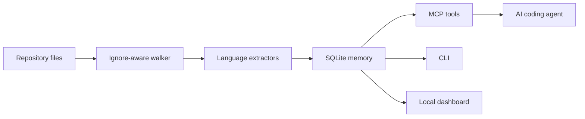

# RepoLens MCP

[](https://github.com/sameer2191/repolens-mcp/actions/workflows/ci.yml)
[](https://github.com/sameer2191/repolens-mcp/actions/workflows/codeql.yml)
[](https://scorecard.dev/viewer/?uri=github.com/sameer2191/repolens-mcp)
[](LICENSE)
[](package.json)

Local-first repository intelligence for AI coding agents. Index a repo into SQLite, expose architecture-aware MCP tools, and inspect code relationships in a browser dashboard.

RepoLens MCP is an original TypeScript implementation built around fast local verification, readable internals, and reviewable engineering evidence. It focuses on the workflows engineers actually need during AI-assisted development: finding code, tracing symbols, checking impact, and preserving architecture decisions.

## Why It Stands Out

- **MCP-native**: exposes 37 tools for indexing, repeatable benchmarking, persistent config, project inventory/status, fleet summaries, cross-repo graphing, multi-agent setup, optional startup auto-indexing, BM25 code search, redacted secret scanning, symbol search, reference lookup, semantic search, vector search, context packs, source snippets, graph schema with relationship patterns and label properties, structural graph search, graph community detection, read-only Cypher-like graph queries, route-call links, runtime trace ingestion, channel/event edges, typed inheritance/implementation/use edges, conservative data-flow edges, import-resolved file graphs, multi-ecosystem package manifests, lockfile resolved-dependency graphs, Docker/Kubernetes infrastructure nodes, dependency-cycle detection, architecture reports, architecture summaries, git-history hotspots, tracing, git-change impact, dead-code candidates, maintainable ADR memory, graph snapshots, and graph package exchange.
- **Agent-ready setup**: `doctor` inspects the local Codex MCP configuration, `install-codex` can add a managed MCP block with dry-run and force safeguards, `uninstall-codex` removes only managed RepoLens config, and `agent-setup`/`install-agents` generate reviewable guidance for Codex, Claude, Gemini, Zed, OpenCode, Antigravity, Aider, KiloCode, VS Code, OpenClaw, and Kiro.
- **Local-first SQLite memory**: all indexed data stays in `.repolens/memory.db`.
- **Project catalog and cross-repo graphing**: `list-projects`, `project-status`, `fleet-summary`, `fleet-graph`, and `delete-project` track indexed repositories, aggregate languages/routes/HTTP calls/dependencies, and produce a catalog-wide graph with shared dependencies, route overlaps, and inferred consumer/provider service links.
- **Incremental refreshes**: skip unchanged files, prune removed files, preserve the existing graph when a repo has not changed, and optionally refresh on MCP startup with `REPOLENS_AUTO_INDEX`.
- **Persistent local config**: `config set auto-index incremental` stores defaults for MCP startup auto-indexing, root, database path, max file size, labels, and graph-package bootstrap without requiring shell env vars.
- **Watch mode**: keep an indexed graph fresh during active coding with polling-based incremental refreshes.
- **Portable graph and report artifacts**: export self-contained HTML graph snapshots, architecture reports, and compressed `.rlgz` graph packages from the CLI; first index can bootstrap a missing database from `.repolens/graph.rlgz`.
- **Operational dashboard**: browse graph previews, structural filters, references, semantic/vector search, schema counts, relationship patterns, label property hints, fleet service links, dead-code candidates, review signals, and report links without a frontend build.
- **Graph communities**: detects functional modules from weighted relationships, not just folder names.
- **Code-aware search ranking**: uses SQLite FTS5 BM25 ranking with indexed camelCase and snake_case term expansion, so `create order` can find `createOrder` without scanning files.
- **Reference lookup**: finds exact indexed identifier references and labels definition lines for language-server-style navigation without requiring an external LSP process.
- **Type relationship graph**: adds `INHERITS`, `IMPLEMENTS`, and `USES_TYPE` edges from class/interface/protocol declarations and typed signatures for safer impact analysis.
- **Local semantic and vector search**: adds dependency-free `SIMILAR_TO` and `SEMANTICALLY_RELATED` edges, concept search, and persisted local vector embeddings over names, paths, signatures, metadata, and symbol bodies.
- **Context packs for agents**: one query can return semantic matches, vector matches, graph matches, BM25 code hits, snippets, and nearby edges for focused development context.
- **Redacted secret scan**: review high-confidence token shapes, sensitive assignments, and environment references from indexed source/config lines without returning raw secret values.
- **Resolved import graph**: creates `IMPORTS_FILE` edges for relative imports, workspace package names, source-root imports, and `tsconfig`/`jsconfig` path aliases.
- **Route-call edges**: stores literal HTTP requests as `http_call` nodes, connects callers with `CALLS_HTTP_ENDPOINT`, and links matching in-repo routes with `HTTP_CALLS`.
- **Runtime trace ingestion**: imports observed HTTP, event, or symbol traces as `OBSERVED_*` graph edges with counts and timestamps.
- **Channel/event edges**: detects EventEmitter, Socket.IO-style, DOM custom event, Python decorator/call, and Swift `NotificationCenter` channels with `EMITS` and `LISTENS_ON` edges.
- **Protocol surfaces**: extracts GraphQL operations/types, gRPC services/RPC routes from protobuf, OpenAPI routes, and common tRPC procedures/calls.
- **Manifest and lockfile dependency graph**: extracts declared package/dependency nodes from npm, Composer, Python, Go, Cargo, Maven, Gradle, Dart, Elixir, Ruby, and `requirements.txt` manifests, plus pinned `lockfile` and `locked_dependency` nodes from common package-manager locks.
- **Infrastructure graph nodes**: indexes Dockerfile stages/images, Kubernetes resources, container images, and Kustomize overlays with `DECLARES`, `CONFIGURES`, and `IMPORTS` edges.
- **Architecture recommendations**: turns structural hotspots, git-history churn, import-resolved dependency cycles, dead-code candidates, and review signals into concrete next steps.
- **Wide practical coverage**: TypeScript, JavaScript, Swift, Python, Go, Java, Rust, SQL, YAML, Markdown, JSON, and shell-oriented project files.
- **Validation evidence**: tests, CI, CodeQL, OpenSSF Scorecard, CycloneDX SBOM generation, GitHub build-provenance attestations, docs, local dashboard smoke checks, and a documented local big-repo validation run.
- **Architecture decisions built in**: persist ADR-style decisions next to the code graph.
- **No frontend build required**: the dashboard is served by the CLI.

## Security And Quality

- **Protected mainline**: `main` requires PR review, CODEOWNERS review, fresh branch checks, resolved conversations, linear history, `verify`, and CodeQL `Analyze`; force pushes and branch deletion are blocked.
- **GitHub security coverage**: CodeQL, OpenSSF Scorecard, Dependabot security updates, secret scanning with push protection, private vulnerability reporting, pinned workflow actions, least-privilege workflow tokens, and a release gate that blocks publishing when CodeQL has open alerts.
- **Property-based fuzzing**: `fast-check` fuzzes import resolver traversal boundaries, safe alias/source-root/workspace-package resolution, and MCP JSON-RPC tool-call validation in `tests/security-fixes.test.ts` and `tests/mcp-server.test.ts`.
- **Release integrity**: npm provenance, GitHub build-provenance attestations, CycloneDX SBOM generation, lockfile dependency graphing, dry-run package validation, and a package contents gate that blocks local graph artifacts from being published.
- **Agent-readable docs**: `llms.txt` and `docs/agent-guide.md` give coding agents a concise operating guide, data-boundary rules, and validation commands.

## Quick Start

```bash
npm install
npm run build
node --experimental-sqlite dist/src/cli.js index .
node --experimental-sqlite dist/src/cli.js architecture
node --experimental-sqlite dist/src/cli.js serve
```

Then open `http://127.0.0.1:9749`.

The dashboard includes code search, reference lookup, semantic/vector search, graph search, graph schema tables with relationship patterns and label property hints, fleet service links, hotspot and boundary summaries, git-history signals, dead-code candidates, and one-click Markdown/HTML architecture reports.

From a local clone, the installer runs the same build and Codex checks:

```bash
./install.sh --install-codex --dry-run
./install.sh --install-codex
./install.sh --install-agents --dry-run
./install.sh --uninstall-agents --dry-run
```

Windows PowerShell uses the same installer flow:

```powershell
.\install.ps1 -InstallCodex -DryRun
.\install.ps1 -InstallCodex
.\install.ps1 -InstallAgents -DryRun
.\install.ps1 -UninstallAgents -DryRun
```

## CLI

```bash
repolens-mcp index [repo] [--db path] [--max-file-bytes n] [--incremental] [--label name] [--write-package [graph.rlgz]]
repolens-mcp index [repo] [--bootstrap-package .repolens/graph.rlgz] [--no-bootstrap]
repolens-mcp benchmark [repo] [--db path] [--max-file-bytes n] [--no-secret-scan]
repolens-mcp list-projects [--limit n]
repolens-mcp project-status [root-or-db-or-label]
repolens-mcp delete-project <root-or-db-or-label> [--delete-db]
repolens-mcp fleet-summary [--limit n]
repolens-mcp fleet-graph [--limit n] [--max-nodes n] [--max-edges n]
repolens-mcp config list|get|set|reset|path [key] [value]
repolens-mcp architecture [--db path]
repolens-mcp search <query> [--db path]
repolens-mcp scan-secrets [--db path] [--limit n] [--min-confidence low|medium|high] [--include-tests]
repolens-mcp symbols <query> [--kind function]
repolens-mcp snippet <symbol-or-path:line> [--context n]
repolens-mcp references <symbol> [--db path] [--limit n]
repolens-mcp trace <symbol> [--direction inbound|outbound|both] [--mode all|calls|data_flow|cross_service] [--parameter name]
repolens-mcp impact <path-or-symbol...>
repolens-mcp schema [--db path]
repolens-mcp communities [--db path] [--limit n] [--min-size n]
repolens-mcp watch [repo] [--db path] [--interval-ms n]
repolens-mcp search-graph [query] [--kind function] [--relationship CALLS] [--min-degree n]
repolens-mcp semantic "live session repository" [--limit n]
repolens-mcp vector "live session repository" [--limit n]
repolens-mcp context-pack "create order" [--limit n] [--context n]
repolens-mcp query-graph "MATCH (a)-[:CALLS]->(b) RETURN a.name,b.name LIMIT 5"
repolens-mcp dead-code [--db path]
repolens-mcp cycles [--db path] [--limit n]
repolens-mcp ingest-traces traces.json [--db path]
repolens-mcp changes [repo] [--db path]
repolens-mcp report [--db path] [--format markdown|html] [--graph-limit n] [--out report.html]
repolens-mcp export-graph --out graph.html [--db path]
repolens-mcp pack-graph --out graph.rlgz [--db path] [--label name]
repolens-mcp unpack-graph graph.rlgz [--db path] [--overwrite]
repolens-mcp doctor [--config ~/.codex/config.toml] [--name repolens]
repolens-mcp install-codex [--db .repolens/memory.db] [--dry-run] [--force]
repolens-mcp uninstall-codex [--dry-run]
repolens-mcp agent-setup [--target .] [--agents all|codex,claude,gemini] [--db .repolens/memory.db]
repolens-mcp install-agents [--target .] [--agents all|codex,claude,gemini] [--dry-run]
repolens-mcp uninstall-agents [--target .] [--agents all|codex,claude,gemini] [--dry-run]
repolens-mcp decision --title "Use SQLite" --body "Keep memory local."
repolens-mcp decision-update 1 --status accepted --tags sqlite,privacy
repolens-mcp decision-delete 1
repolens-mcp serve [--db path] [--port 9749]
repolens-mcp mcp
```

## MCP Tools

| Tool | Purpose |
| --- | --- |
| `index_repository` | Build or refresh the local SQLite memory, optionally bootstrapping from a `.rlgz` graph package when the database is missing. |
| `benchmark_repository` | Run full and no-op incremental indexing, graph totals, throughput, and optional redacted secret-scan summary for repeatable performance evidence. |
| `export_graph_package` | Create a compressed, checksummed `.rlgz` package from an indexed graph database. |
| `import_graph_package` | Import a compressed `.rlgz` package into a local graph database. |
| `manage_config` | Read or update persistent RepoLens defaults for startup auto-indexing and graph paths. |
| `list_projects` | List repositories indexed through RepoLens on this machine. |
| `index_status` | Return the latest indexed status for a root, database path, label, or project folder name. |
| `delete_project` | Remove a project from the local catalog, with optional safe `.repolens` DB cleanup. |
| `fleet_summary` | Aggregate indexed projects by language, package, dependency, route, HTTP call, route overlap, and inferred service link. |
| `cross_repo_graph` | Return a catalog-wide graph of indexed repositories, shared dependencies, overlapping routes, and inferred cross-repo HTTP caller/provider edges. |
| `agent_setup` | Render or write project-local RepoLens MCP setup guidance for supported coding agents. |
| `search_code` | Search indexed source lines with BM25 ranking and code-aware token expansion. |
| `scan_secrets` | Scan indexed source/config lines for redacted secret, token, credential, and sensitive environment patterns. |
| `search_symbols` | Search functions, classes, routes, resources, headings, and package nodes. |
| `get_code_snippet` | Return source lines around a symbol, qualified name, file path, or `path:line` target. |
| `find_references` | Find indexed definition and reference lines for a symbol or identifier. |
| `get_architecture` | Return language mix, hotspots, git-history churn, entrypoints, packages, and risk markers. |
| `trace_symbol` / `trace_path` | Trace inbound, outbound, or bidirectional paths around a symbol; modes include calls, data flow, cross-service HTTP/event edges, and unfiltered graph traversal. |
| `impact_analysis` | Find adjacent symbols for changed files or symbols. |
| `get_graph_schema` | Return node labels, edge types, relationship patterns, label properties, language coverage, and totals. |
| `find_communities` | Detect weighted graph communities with representative symbols, cohesion, and boundary counts. |
| `search_graph` | Search structurally by query, kind, regex, relationship, file scope, or degree. |
| `semantic_search` | Search symbols by local semantic token overlap across names, paths, signatures, and bodies. |
| `vector_search` | Search symbols with deterministic local vector embeddings over names, paths, signatures, metadata, and bodies. |
| `context_pack` | Return semantic matches, vector matches, graph matches, code hits, snippets, and nearby edges for one query. |
| `query_graph` | Run a read-only Cypher-like query over symbols and one-hop edges. |
| `find_dead_code` | Find non-exported functions and methods with no inbound call edges. |
| `find_dependency_cycles` | Find import-resolved dependency cycles between architecture clusters. |
| `ingest_traces` | Add observed runtime HTTP, event, or symbol edges as `OBSERVED_*` relationships. |
| `detect_changes` | Map uncommitted git changes to indexed graph impact with per-file blast radius, relationship counts, and risk reasons. |
| `architecture_report` | Generate a markdown or HTML architecture report with graph, hotspot, history, risk, and recommendation sections. |
| `remember_decision` | Persist an ADR-style architecture decision. |
| `list_decisions` | Retrieve saved decisions. |
| `update_decision` | Update an existing architecture decision without rewriting unspecified fields. |
| `delete_decision` | Delete an architecture decision by id. |
| `graph_snapshot` | Export compact graph data for dashboards or reviews. |

## Supported Extraction

The extractor is intentionally compact and extensible:

- TypeScript and JavaScript: classes, interfaces, types, functions, const functions, imports, resolved local import edges, Express-style routes, and Next.js App Router `app/api/**/route.ts` handlers.
- Conservative data-flow edges: maps meaningful call arguments to target parameters when the callee can be resolved without ambiguous duplicate names, and prunes stale `DATA_FLOWS` edges during incremental refreshes.
- Trace modes: `trace_path` can focus on call paths, value propagation through `DATA_FLOWS`, cross-service HTTP/event paths, or all nearby edges.
- HTTP call linking: literal `fetch`, Axios, and Node `http` calls become `http_call` nodes with `CALLS_HTTP_ENDPOINT`; matching route nodes also receive `HTTP_CALLS`.
- GraphQL, gRPC, and OpenAPI: `.graphql`, `.gql`, `.proto`, OpenAPI JSON, and OpenAPI YAML files produce protocol nodes; protobuf `rpc` methods become route nodes using `/Service/Method` paths, and OpenAPI `{id}` path params normalize to `:id`.
- tRPC: common procedure declarations and client calls become `trpc_procedure` and `trpc_call` nodes.
- Channel/event linking: EventEmitter/Socket.IO-style `emit`, `on`, `once`, `addListener`, `subscribe`, DOM `CustomEvent`, Python `@*.on`, and Swift `NotificationCenter` patterns become `channel` nodes with `EMITS` and `LISTENS_ON` edges.
- Swift: classes, structs, enums, protocols, actors, functions, and imports.
- Python: classes, functions, imports, route decorators.
- Go, Java, Rust: common functions, types, classes, traits, structs, imports.
- SQL: created tables, views, indexes, functions, procedures.
- YAML: multi-document Kubernetes resources from `kind` and `metadata.name`, container image links, and Kustomize `resources`, `bases`, and `components`.
- Dockerfile: build stages, base images, and `COPY --from` stage dependencies.
- Markdown: headings as knowledge nodes.
- Manifest files: `package.json`, `composer.json`, `pyproject.toml`, `requirements.txt`, `go.mod`, `Cargo.toml`, `pom.xml`, `build.gradle`, `pubspec.yaml`, `mix.exs`, and `*.gemspec` package/dependency nodes.
- Lockfiles: `package-lock.json`, `npm-shrinkwrap.json`, `pnpm-lock.yaml`, `yarn.lock`, `composer.lock`, `Cargo.lock`, `poetry.lock`, `go.sum`, and `Gemfile.lock` become `lockfile` and `locked_dependency` nodes connected by `LOCKS` edges.

### Repository Ignore Rules

Add `.repolensignore` at the repository root to exclude generated code, local scratch folders, vendored samples, or sensitive paths from indexing. Rules are path-relative globs with `!` negation, similar to `.gitignore`; RepoLens still applies its built-in skips for dependency folders, build outputs, binaries, and `.repolens` artifacts.

## Query Graph Subset

`query-graph` and `query_graph` are read-only. Supported patterns:

```cypher
MATCH (f:Function) WHERE f.name = 'main' RETURN f.name,f.filePath LIMIT 10
MATCH (a)-[r:CALLS]->(b) WHERE b.name CONTAINS 'order' RETURN a.name,b.name,r.type LIMIT 10
MATCH (a)<-[:CALLS]-(b) RETURN a.name,b.name LIMIT 10
MATCH (f:Function) RETURN count(f) AS functions
MATCH (f:Function) RETURN DISTINCT f.name ORDER BY f.name SKIP 10 LIMIT 10
```

Supported `WHERE` operators are `=`, `<>`, `CONTAINS`, `STARTS WITH`, and `ENDS WITH`, joined with `AND`.
Supported result clauses include `RETURN DISTINCT`, `count(...)`, `ORDER BY`, `SKIP`, and `LIMIT`.

## Validation

```bash
npm run verify
npm run package:check
npm run audit:prod
GITHUB_REPOSITORY=sameer2191/repolens-mcp GH_TOKEN="$(gh auth token)" npm run security:github
node --experimental-sqlite dist/src/cli.js index /path/to/big/repo --db /tmp/memory.db
node --experimental-sqlite dist/src/cli.js benchmark /path/to/big/repo --db /tmp/benchmark.db
node --experimental-sqlite dist/src/cli.js list-projects
node --experimental-sqlite dist/src/cli.js project-status /path/to/big/repo
node --experimental-sqlite dist/src/cli.js fleet-summary
node --experimental-sqlite dist/src/cli.js fleet-graph --limit 20 --max-nodes 500 --max-edges 1000
node --experimental-sqlite dist/src/cli.js index /path/to/big/repo --db /tmp/memory.db --incremental
node --experimental-sqlite dist/src/cli.js architecture --db /tmp/memory.db
node --experimental-sqlite dist/src/cli.js schema --db /tmp/memory.db
node --experimental-sqlite dist/src/cli.js communities --db /tmp/memory.db --limit 12
node --experimental-sqlite dist/src/cli.js snippet createOrder --db /tmp/memory.db
node --experimental-sqlite dist/src/cli.js references createOrder --db /tmp/memory.db
node --experimental-sqlite dist/src/cli.js semantic "order checkout flow" --db /tmp/memory.db
node --experimental-sqlite dist/src/cli.js vector "order checkout flow" --db /tmp/memory.db
node --experimental-sqlite dist/src/cli.js context-pack "order checkout flow" --db /tmp/memory.db
node --experimental-sqlite dist/src/cli.js cycles --db /tmp/memory.db
node --experimental-sqlite dist/src/cli.js query-graph "MATCH (f:Function) RETURN f.name,f.filePath LIMIT 5" --db /tmp/memory.db
node --experimental-sqlite dist/src/cli.js ingest-traces traces.json --db /tmp/memory.db
node --experimental-sqlite dist/src/cli.js report --db /tmp/memory.db --format html --out report.html
node --experimental-sqlite dist/src/cli.js export-graph --db /tmp/memory.db --out graph.html --limit 1000
node --experimental-sqlite dist/src/cli.js pack-graph --db /tmp/memory.db --out graph.rlgz --label validation
node --experimental-sqlite dist/src/cli.js unpack-graph graph.rlgz --db /tmp/imported-memory.db
node --experimental-sqlite dist/src/cli.js watch /path/to/big/repo --db /tmp/memory.db --interval-ms 2500
node --experimental-sqlite dist/src/cli.js config set auto-index incremental
node --experimental-sqlite dist/src/cli.js config set root /path/to/big/repo
node --experimental-sqlite dist/src/cli.js serve --db /tmp/memory.db --port 9749
node --experimental-sqlite dist/src/cli.js agent-setup --target /tmp/project --agents all
```

The repo includes `docs/research-notes.md` with source-research notes and the design decisions behind this implementation.
It also includes `docs/validation-report.md` with the local self-index and `/Users/sameer/Desktop/testing` big-repo validation results.

## Team-Shared Graph Bootstrap

Create a reusable graph package:

```bash
repolens-mcp index . --db .repolens/memory.db --write-package
```

`--write-package` without a value writes `.repolens/graph.rlgz` after a successful index. Pass a path such as `--write-package artifacts/service.rlgz` to write somewhere else, or use `REPOLENS_WRITE_PACKAGE=.repolens/graph.rlgz` for session-wide automation. `.rlgz` packages are marked as binary by `.gitattributes`; review them before force-adding ignored `.repolens` artifacts to a repository.

On another machine or a fresh clone, the first index will import `.repolens/graph.rlgz` when the target database is missing, then run an incremental refresh for local changes:

```bash
repolens-mcp index . --db .repolens/memory.db
```

Use `--bootstrap-package path/to/graph.rlgz` for a custom artifact, `REPOLENS_BOOTSTRAP_PACKAGE=path/to/graph.rlgz` for MCP/session-wide configuration, or `--no-bootstrap` / `REPOLENS_BOOTSTRAP_PACKAGE=0` to force a fresh database.

## MCP Client Config

Codex users can inspect or install the MCP entry directly:

```bash
repolens-mcp doctor
repolens-mcp install-codex --db .repolens/memory.db --dry-run
repolens-mcp install-codex --db .repolens/memory.db
repolens-mcp uninstall-codex --dry-run
```

`install-codex` refuses to replace an existing unmanaged `mcp_servers.repolens` entry unless `--force` is passed. `uninstall-codex` removes only the RepoLens managed block and leaves unmanaged MCP entries untouched.

Optional startup indexing for MCP sessions:

```toml
[mcp_servers.repolens.env]
REPOLENS_DB = ".repolens/memory.db"
REPOLENS_AUTO_INDEX = "1"          # incremental startup refresh
REPOLENS_ROOT = "."                # optional, defaults to process cwd
REPOLENS_MAX_FILE_BYTES = "750000" # optional
```

Set `REPOLENS_AUTO_INDEX=full` to force a full rebuild on startup. Leave it unset for the default manual-index behavior.

You can also persist those defaults without shell env vars:

```bash
node --experimental-sqlite dist/src/cli.js config set auto-index incremental
node --experimental-sqlite dist/src/cli.js config set root /path/to/repo
node --experimental-sqlite dist/src/cli.js config set db-path /path/to/repo/.repolens/memory.db
```

Project teams can generate agent guidance and config snippets for the broader agent set:

```bash
repolens-mcp agent-setup --target . --agents all
repolens-mcp install-agents --target . --agents codex,claude,gemini --dry-run
repolens-mcp install-agents --target . --agents codex,claude,gemini
repolens-mcp uninstall-agents --target . --agents codex,claude,gemini --dry-run
```

`install-agents` writes managed markdown blocks into project-local instruction files and a `docs/repolens-agent-setup.md` guide. `uninstall-agents` removes those managed markdown blocks while preserving hand-written content. The guide includes MCP config snippets for Codex, Claude, Gemini, Zed, OpenCode, Antigravity, Aider, KiloCode, VS Code, OpenClaw, and Kiro.

```json
{
  "mcpServers": {
    "repolens-mcp": {
      "command": "npx",
      "args": ["-y", "repolens-mcp", "mcp"],
      "env": {
        "REPOLENS_DB": ".repolens/memory.db"
      }
    }
  }
}
```

## Architecture



## Roadmap

- Deeper tree-sitter adapters for language-specific call/use precision.
- Host-aware service-link inference from config, environment variables, and trace data.
